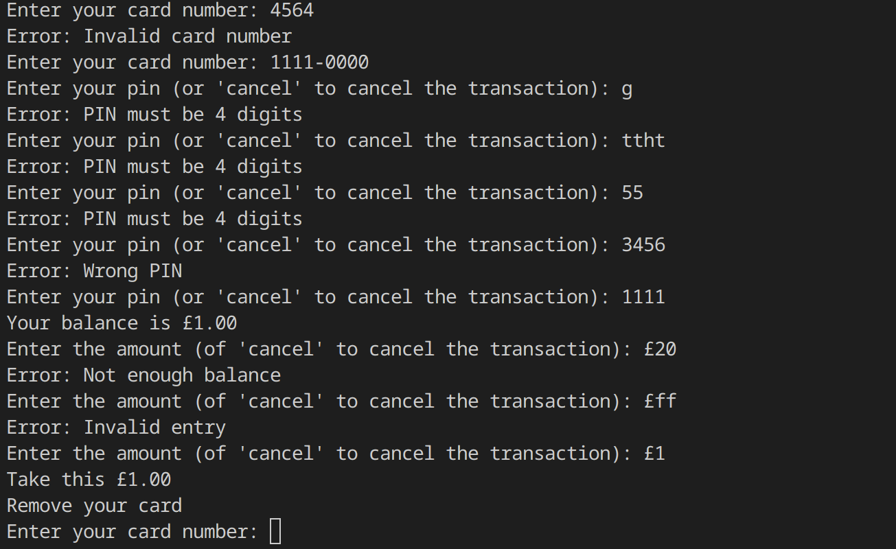

# Other Challenges

Other challenges that are not in the little book of challenges

## ATM
Allows the user to interact with an ATM-like program to withdraw money

## Cassini
Calculates whether a sequence of bits has odd or even parity

## Exam Grade
Given a exam mark, prints the grade number and the number of marks to the next grade

## Nitrate
Given a level of nitrate in a pool, prints the amount of carbon that should be added to counteract it

## Periodic Table
Given the name, symbol, or atomic number of an element, prints out various information about the element. Has info about all 118 elements.

## Prime
Checks whether a given number is prime or not

## Scrabble
Calculates what score a word would get in scrabble

